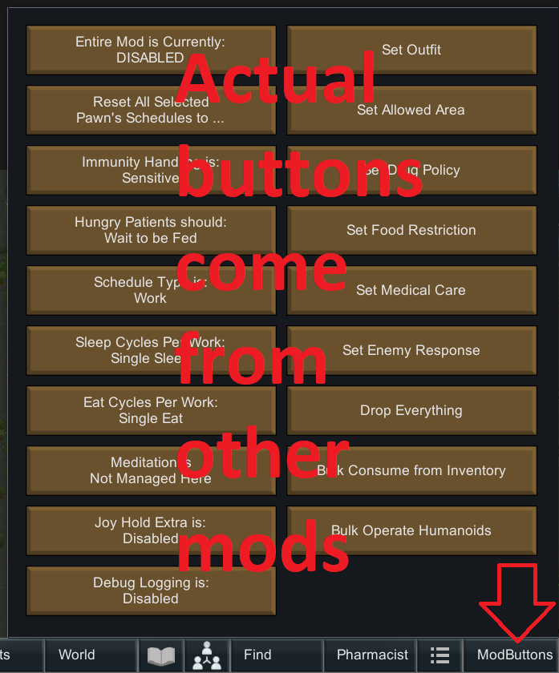

# ModButtons

This is a mod for the game RimWorld by Ludeon Studios.

It offers a simple tab at the bottom that other mods can use for buttons.

We're on Steam: https://steamcommunity.com/sharedfiles/filedetails/?id=2324534249

# Table of Contents

* [Introduction and Explanation](#introduction-and-explanation)
* [How to Install](#how-to-install)
* [How to Update](#how-to-update)
* [Bugs, New Features, and Updates](#bugs-new-features-and-updates)

# Introduction and Explanation

This mod doesn't actually do anything interesting on its own.

It simply adds a tab at the bottom that many other mods can use to consolidate buttons.

A bunch of my other mods use this:

* https://github.com/maarxx/SmarterScheduling
* https://github.com/maarxx/BulkAssigner
* https://github.com/maarxx/FixStackedAnimalLag

